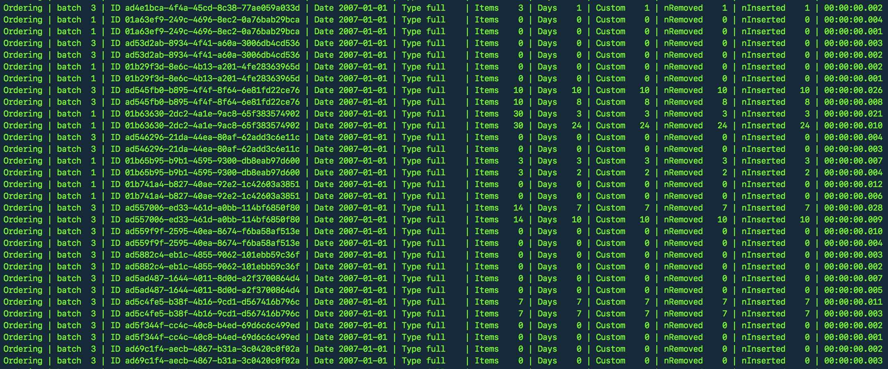

This module allows you to log objects into a single row.


```js
// example data to be logged
const data = {
  "user": {
    "name": {
      "first": "John",
      "last": "Smith"
    },
    "email": "john.smith@log.row"
  },
  "order": {
    "status": "pending",
    "orderId": "DS5031",
    "date": "2019-05-03"
  }
}
const row = logRow(settings) // see below for settings
console.log(row(data))
```
Logs the following
```
OrderID DS5031 | 2019-05-03 | Status pending  | Email john.smith@log.row
```

### Installation

```bash
npm install log-row --save-dev
```

### Usage
```js
const logRow = require("log-row")

const row = logRow({
  hideMissingKeys: true,
  defaultAlign: "right",
  separator: " • ",
  columns: [
    "Foo",
    { key: "foobar", label: "Foo", widh: 4, truncate: true },
    { key: "animal", label: "Animal", width: 8, align: "left" },
    { key: "fruit", label: "Fruit", width: 8 pad: "·" }
  ]
})

console.log(row({ animal: "Cat", fruit: "Peach" }))
// Foo • Animal Cat      • Fruit    Peach

console.log(row({ animal: "Dog", fruit: "Apple", foobar: "hello world!" }))
// Foo • foobar rld! • Animal Dog      • Fruit    Apple
```

### Settings
The `logRow` method returns a function, which when called will format the object passed in as a string using the column setting provided as below. The following also shows the defaults for each property.

```js
const row = logRow({
  separator: " | ",
  hideMissingKeys: true, // if set then keys that don't 
                         // exist the object will be hidden
  defaultAlign: "right",
  columns: [
    "foo" // each column entry can be string or object
          // strings will be printed as is
    { 
      key: "foo.bar",  // path from where to get the value on the object
      label: "FooBar", // is not provided key will be used as label,
                       // if set to null no label will be displayed
      width: 5,        // if provided column will be aligned
                       // to specified characters
      align: "right",  // defaults to the value specified for defaultAlign
      pad: " ",        // when width and align is specified the pad string
                       // will be used for alignment
      truncate: false  // value will be truncated to fit column
                       // width is set to true
    },
    // sepcify more columns here...
  ]
})
```